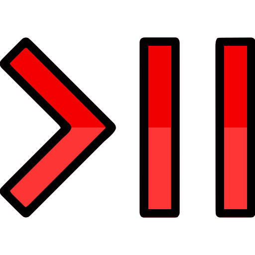

<!-- PROJECT LOGO -->
 

  

  <h1 align="center">YouPipe</h3>

  

    <a href="https://youpipe-frontend.vercel.app/">View Demo</a>
    &middot;
    <a href="https://github.com/MrRo-bot/YouPipe/issues/new?labels=bug&template=bug-report---.md">Report Bug</a>
    &middot;
    <a href="https://github.com/MrRo-bot/YouPipe/issues/new?labels=enhancement&template=feature-request---.md">Request Feature</a>
  

<!-- ABOUT THE PROJECT -->

# About The Project ℹ️💁‍♂️

A Simple `YOUTUBE CLONE` 👥▶️ with not so simple glass like layout called glassmorphism, which I've been already working on for past months and apple released it recently calling it liquid glass, this site is created to demonstrate the use of Modern JS libraries and Frameworks 🏗.
I am a software developer with a keen interest in both creating projects and managing personal finances (My only not so social app that I use a lot is YouTube so I thought why not a youtube clone).
There were limitations in the API which posed several issues but I've managed to incorporate as many features as possible.

<!-- MAIN FEATURES -->

### Main Features

- Includes everything that youtube provides except some costly API calls like for eg. inserting video, playlist edits, and excluding many features that are not available in api itself like podcasts, shorts,watch later, saved playlists, etc.
- `@React-oauth/google` and `google-auth-library` for easy google login,
- `Redux-toolkit` for storing data received from API endpoints,
- `Tanstack-query` for querying complex API calls,
- `React-router` for managing multi-page layouts,

_Made with love ❤️ by [MrRo-bot](https://github.com/MrRo-bot)_

<!-- BUILT WITH -->

# Built With 🛠️🤖

- [![React.js]][React-url]
- [![Node.js]][Node.js-url]
- [![Express]][Express-url]
- [![ReactRedux]][ReactRedux-url]
- [![TailwindCSS]][TailwindCSS-url]
- [![Motion]][Motion-url]
- [![ReactRouter]][ReactRouter-url]
- [![Vite]][Vite-url]
- [![NPM]][NPM-url]
- ![Firefox]
- [React Virtuoso](https://virtuoso.dev/)
- [React Toastify](https://fkhadra.github.io/react-toastify/introduction)
- [React Loading Skeleton](https://github.com/dvtng/react-loading-skeleton)
- [React Icons](https://react-icons.github.io/react-icons/search)
- [React OAuth Gooogle](https://www.npmjs.com/package/@react-oauth/google)
- [Gooogle Auth Library](https://www.npmjs.com/package/google-auth-library)
- and many more....

<!-- ROADMAP -->

# Roadmap 🛣️

- [x] Hosting in vercel using monorepo architecture
- [x] Remember to remove developer related tools in final project
- [ ] Issues with channel overview not clearing items when new channel overview comes (BIG ISSUE unable to solve)
- [ ] Playing all playlists at once [using url array (create url array from playlist items first)] (need to sort how to get beyond 50 results in queue as well)
- [ ] Undo action in react toastify
- [ ] Sort option in commentSection, playlistOverview
- [ ] Category search (requires video(videoCategoryId))
- [ ] Tooltips
- [ ] Accessibility checks
- [ ] Search issue when re-edited search string

See the [open issues](https://github.com/MrRo-bot/YouPipe/issues) for a full list of proposed features (and known issues).

<!-- LICENSE -->

# License 🪪

Distributed under the Unlicense License. See `LICENSE.md` for more information.

<!-- CONTACT -->

# Contact 📲

Outlook Mail - [chhavimanichoubey.outlook.in](mailto://chhavimanichoubey.outlook.in)

Discord: [Mr.RO130T](https://discordapp.com/users/434001308484239381)

Project Link: [https://github.com/MrRo-bot/YouPipe](https://github.com/MrRo-bot/YouPipe)

<!-- ACKNOWLEDGMENT -->

# Acknowledgment 📝

- [![YoutubeDataApiv3]][YoutubeDataApiv3-url]
- [![GoogleCloud]][GoogleCloud-url]
- [![daily.dev]][daily.dev-url]
- [![Dev.to]][Dev.to-url]
- [![Medium]][Medium-url]
- [![Dribbble]][Dribble-url]
- [![GeeksForGeeks]][GeeksForGeeks-url]
- [![Scrimba]][Scrimba-url]

<!-- MARKDOWN LINKS & IMAGES -->

[Express]: https://img.shields.io/badge/express.js-%23404d59.svg?style=for-the-badge&logo=express&logoColor=%2361DAFB
[Express-url]: https://expressjs.com/
[React.js]: https://img.shields.io/badge/React-20232A?style=for-the-badge&logo=react&logoColor=61DAFB
[React-url]: https://reactjs.org/
[Node.js]: https://img.shields.io/badge/node.js-6DA55F?style=for-the-badge&logo=node.js&logoColor=white
[Node.js-url]: https://nodejs.org/
[TailwindCSS]: https://img.shields.io/badge/tailwindcss-%2338B2AC.svg?style=for-the-badge&logo=tailwind-css&logoColor=white
[TailwindCSS-url]: https://tailwindcss.com/
[Motion]: https://img.shields.io/badge/Framer-black?style=for-the-badge&logo=framer&logoColor=blue
[Motion-url]: https://motion.dev/
[ReactRouter]: https://img.shields.io/badge/React_Router-CA4245?style=for-the-badge&logo=react-router&logoColor=white
[ReactRouter-url]: https://reactrouter.com/
[Firefox]: https://img.shields.io/badge/Firefox-FF7139?style=for-the-badge&logo=Firefox-Browser&logoColor=white
[daily.dev]: https://img.shields.io/badge/daily.dev-CE3DF3?style=for-the-badge&logo=daily.dev&logoColor=white
[daily.dev-url]: https://daily.dev/
[Dev.to]: https://img.shields.io/badge/dev.to-0A0A0A?style=for-the-badge&logo=dev.to&logoColor=white
[Dev.to-url]: https://dev.to/
[Dribbble]: https://img.shields.io/badge/Dribbble-EA4C89?style=for-the-badge&logo=dribbble&logoColor=white
[Dribble-url]: https://dribbble.com/
[GeeksForGeeks]: https://img.shields.io/badge/GeeksforGeeks-gray?style=for-the-badge&logo=geeksforgeeks&logoColor=35914c
[GeeksForGeeks-url]: https://geeksforgeeks.org/
[Scrimba]: https://img.shields.io/badge/scrimba-2B283A?style=for-the-badge&logo=scrimba&logoColor=white
[Scrimba-url]: https://scrimba.com/
[Vite]: https://img.shields.io/badge/vite-%23646CFF.svg?style=for-the-badge&logo=vite&logoColor=white
[Vite-url]: https://vite.dev
[NPM]: https://img.shields.io/badge/NPM-%23CB3837.svg?style=for-the-badge&logo=npm&logoColor=white
[NPM-url]: https://npmjs.com/
[Medium]: https://img.shields.io/badge/Medium-12100E?style=for-the-badge&logo=medium&logoColor=white
[Medium-url]: https://medium.com/
[YoutubeDataApiv3]: https://img.shields.io/badge/YouTube-%23FF0000.svg?style=for-the-badge&logo=YouTube&logoColor=white
[YoutubeDataApiv3-url]: https://developers.google.com/youtube/v3/
[GoogleCloud]: https://img.shields.io/badge/Google%20Cloud-%234285F4.svg?style=for-the-badge&logo=google-cloud&logoColor=white
[GoogleCloud-url]: https://console.google.com/
[ReactRedux]: https://img.shields.io/badge/Redux-764ABC?style=for-the-badge&logo=redux&logoColor=fff
[ReactRedux-url]: https://redux-toolkit.js.org/
